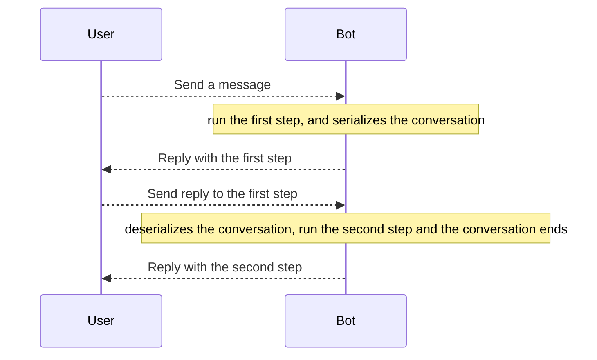

# Conversations

:::warning
If you are using the `Webhook` update mode, you need a persistent cache adapter to use this feature!
:::

## Concept

Often, compared to a simple question and answer, you have to make the user perform a series of steps in a certain
sequence: the framework implements a **conversations system**, that allows you to create funnels with which you can make
your users perform a series of steps.



## Creating Conversations

To create a conversation, you must define a class that extends the framework `Conversation` class:

```php
use SergiX44\Nutgram\Conversations\Conversation;
use SergiX44\Nutgram\Nutgram;

class MyConversation extends Conversation {

    public function start(Nutgram $bot)
    {
        $bot->sendMessage('This is the first step!');
        $this->next('secondStep');
    }

    public function secondStep(Nutgram $bot)
    {
        $bot->sendMessage('Bye!');
        $this->end();
    }
}

$bot = new Nutgram($_ENV['TOKEN']);

$bot->onCommand('start', MyConversation::class);

$bot->run();
```

- **Wait wait, whats going on here?**
    - When the user type *"/start"* for the first time, the first step of conversation is invoked, by default is
      the `start` method.
    - At the end of the first step, we define the next step of the conversation, setting the name of the next function,
      that will be **serialized to cache**.
    - In the second step, we are ending the conversation.

:::note
If a conversation is not explicitly terminated with the `end()`, at the user next message will repeat the lastest saved step!
:::

If you want to customize the name of the first step, you just need to override the `$step` property from conversation:

```php
use SergiX44\Nutgram\Conversations\Conversations\Conversation;
use SergiX44\Nutgram\Nutgram;

class MyConversation extends Conversation {

    protected ?string $step = 'myStart';

    public function myStart(Nutgram $bot)
    {
        $bot->sendMessage('This is the first step!');
    }

    // ...
```

A more complete example:

```php
use SergiX44\Nutgram\Conversations\Conversation;
use SergiX44\Nutgram\Nutgram;
use SergiX44\Nutgram\Telegram\Types\Keyboard\InlineKeyboardButton;
use SergiX44\Nutgram\Telegram\Types\Keyboard\InlineKeyboardMarkup;

class AskIceCreamConversation extends Conversation {

    protected ?string $step = 'askCupSize';

    public $cupSize;

    public function askCupSize(Nutgram $bot)
    {
        $bot->sendMessage(
            text: 'How big should be you ice cream cup?', 
            reply_markup: InlineKeyboardMarkup::make()
                ->addRow(InlineKeyboardButton::make('Small', callback_data: 'S'), InlineKeyboardButton::make('Medium', callback_data: 'M'))
                ->addRow(InlineKeyboardButton::make('Big', callback_data: 'L'), InlineKeyboardButton::make('Super Big', callback_data: 'XL')),
        );
        $this->next('askFlavors');
    }

    public function askFlavors(Nutgram $bot)
    {
        // if is not a callback query, ask again!
        if (!$bot->isCallbackQuery()) {
            $this->askCupSize($bot);
            return;
        }

        $this->cupSize = $bot->callbackQuery()->data;

        $bot->sendMessage('What flavors do you like?');
        $this->next('recap');
    }

    public function recap(Nutgram $bot)
    {
        $flavors = $bot->message()->text;
        $bot->sendMessage("You want an $this->cupSize cup with this flavors: $flavors");
        $this->end();
    }
}
```

## Begin a Conversation

As you have already seen in the previous examples, conversation can be used in replacement for handlers:

```php
use SergiX44\Nutgram\StartConversation;
use SergiX44\Nutgram\Nutgram;

$bot = new Nutgram($_ENV['TOKEN']);

$bot->onCommand('start', StartConversation::class);

$bot->run();
```

But, you can also start a conversation at any time from another handlers, with the `begin` method:

```php
use SergiX44\Nutgram\StartConversation;
use SergiX44\Nutgram\Nutgram;

$bot = new Nutgram($_ENV['TOKEN']);

$bot->onCommand('start', function (Nutgram $bot) {
    // do stuff
    StartConversation::begin($bot); // the first step will be automatically fired
});

$bot->run();
```

### Starting a conversation from server-side

You can also start a conversation from server-side, without any user interaction:

```php
use SergiX44\Nutgram\StartConversation;

StartConversation::begin(
    bot: $bot, 
    userId: $userID, 
    chatId: $chatID
);
```

:::caution
Starting a conversation from server-side, will not give you a Telegram update, so you will not be able to use the
`$bot->chatId()` and `$bot->userId()` methods, you need to pass them manually!
:::

To get the chat id and user id inside a Conversation, you can use the `getChatId` and `getUserId` methods.

```php
class StartConversation extends Conversation
{
    public function start(Nutgram $bot)
    {
        $bot->sendMessage(
            text: 'Hello!',
            chat_id: $this->getChatId(),
        );
        
        //[...]
    }
}
```

### Passing parameters to a conversation

You can also pass parameters to a conversation.

Consider the following example:

```php
class StartConversation extends Conversation
{
    public function start(Nutgram $bot, string $name)
    {
        $bot->sendMessage("Hello $name");
        $this->end();
    }
}
```

#### Via handler

```php
$bot->onCommand('start {name}', StartConversation::class);
```

#### Via the `begin` method

```php
$bot->onCommand('start', function (Nutgram $bot) {
    StartConversation::begin($bot, data: [
        'name' => 'static name',
    ]);
});
```

## Funnel Escaping

By default, sends a message that match with a typed **specific** handler, the current conversation will be discarded, in
any case, it may be necessary to force the user inside a funnel (for example in a settings modification flow):

```php
use SergiX44\Nutgram\Conversations\Conversation;
use SergiX44\Nutgram\Nutgram;

class MyConversation extends Conversation {

    // ..

    public function step(Nutgram $bot)
    {
        $bot->sendMessage('This is the first step!');
        $this->setSkipHandlers(true)
            ->next('secondStep');
    }

    // ..
}
```

In this way, your will force the next step execution.

## Stop Conversation on Generic Handlers

By default, sends a message that match with a typed **specific** handler, the current conversation will be discarded,
but in some cases, you may want to stop the conversation when a generic handler is triggered (e.g. `myChatMember`).

In this case, you can use the `willStopConversations()` method on handlers to stop the conversation when a generic
handler is triggered.

```php
$bot = new Nutgram('your-token');

$bot->onCommand('start', MyConversation::class);

$bot->onMyChatMember(MyChatMemberHandler::class)
    ->willStopConversations();

$bot->run();
```

This enhancement ensures that events like `myChatMember` can properly take precedence over ongoing conversations,
improving the application's ability to process user departures and other crucial state changes efficiently.

## Middleware

By default, global middlewares are also applied before the conversation step, there may be situations, however, where
you want to be avoided (e.g. in a registration flow):

```php
use SergiX44\Nutgram\Conversations\Conversation;
use SergiX44\Nutgram\Nutgram;

class MyConversation extends Conversation {

    // ..

    public function step(Nutgram $bot)
    {
        $bot->sendMessage('This is the first step!');
        $this->setSkipMiddlewares(true)
            ->next('secondStep');
    }

    // ..
}
```

In this way, your next step will be executed without any middleware before.

The two options before are also stackable:

```php
use SergiX44\Nutgram\Conversations\Conversation;
use SergiX44\Nutgram\Nutgram;

class MyConversation extends Conversation {

    // ..

    public function step(Nutgram $bot)
    {
        $bot->sendMessage('This is the first step!');
        $this->setSkipHandlers(true)
            ->setSkipMiddlewares(true)
            ->next('secondStep');
    }

    // ..
}
```

## Closing Hook

You can override the `closing` method to define a custom behaviour when the conversation is closed.

This method will be called every time a conversation is terminated, due to explicit call to `end`, or because
[funnel escaping](conversations.md#funnel-escaping).

This is useful for shutting stuff down, saving to a database or simply let the user know that the conversation is
terminated.

```php
use SergiX44\Nutgram\Conversations\Conversation;
use SergiX44\Nutgram\Nutgram;

class MyConversation extends Conversation {

    public function step(Nutgram $bot)
    {
        $bot->sendMessage('Time to say goodbye!');
        $this->end();
    }
    
    //This method will be called!
    public function closing(Nutgram $bot)
    {
        $bot->sendMessage('Bye!');
    }
}
```

## Procedural Usage

It's possible to start a conversation also without a OOP approach, in this way:

```php
use SergiX44\Nutgram\Nutgram;

$bot = new Nutgram($_ENV['TOKEN']);

$bot->onCommand('start', 'firstStep');


function firstStep(Nutgram $bot)
{
    // do stuff
    $bot->stepConversation('secondStep');
}

function secondStep(Nutgram $bot)
{
    // do stuff
    $bot->endConversation();
}

$bot->run();
```

:::warning
Using conversations in this way, you will not be able to skip middlewares or skip handlers!

By default, it will always allow funnel escaping and will always apply global middlewares.
:::

## Inline Usage

For very short conversations, you can also define the next step as a closure, with the same limitations of the
procedural usage:

```php
use SergiX44\Nutgram\Nutgram;

$bot = new Nutgram($_ENV['TOKEN']);

$bot->onCommand('start', function (Nutgram $bot) {
    // step one
    $bot->stepConversation(function (Nutgram $bot){
        // step two
        $bot->endConversation();
    });
});

$bot->run();
```

## Advanced

### Define attribute serialization behaviour

By default, any attribute in you conversation call that is set as `private` will not be serialised, so it will not get
carried to the next conversation step:

```php

use SergiX44\Nutgram\Conversations\Conversation;
use SergiX44\Nutgram\Nutgram;

class MyConversation extends Conversation 
{
    private ?Message $message = null;

    public function start(Nutgram $bot)
    {
        $this->message = $bot->sendMessage('This is the first step!');
        $this->next('secondStep');
    }

    public function secondStep(Nutgram $bot)
    {
        // `$this->message` will be null
    }
    
}

```

This is especially useful when you are dealing with object that are not serializable, such closures and anything
related to it.

However, is possible to override this behaviour by defining the `getSerializableAttributes`:
```php

use SergiX44\Nutgram\Conversations\Conversation;
use SergiX44\Nutgram\Nutgram;

class MyConversation extends Conversation 
{
    private ?Message $message = null;

    protected function getSerializableAttributes(): array
    {
        return [
            'message' => $this->message,
        ];
    }
    
    public function start(Nutgram $bot)
    {
        $this->message = $bot->sendMessage('This is the first step!');
        $this->next('secondStep');
    }

    public function secondStep(Nutgram $bot)
    {
        // `$this->message` is available!
    }
    
}

```

### Refreshing deserialized conversations

This is useful when you are leveraging on some kind IoC container (for example by using the Laravel or Symfony packages)
to inject services inside your conversation, that are not serializable.

The framework can refresh and re-inject automatically those instances automatically when a conversation is deserialized;
You can activate this feature by calling the static method `Conversation::refreshOnDeserialize()`.

```php

use SergiX44\Nutgram\Conversations\Conversation;
use SergiX44\Nutgram\Nutgram;

class MyConversation extends Conversation 
{
    private \MyService $service;
    
    public function __construct(\MyService $service) { // called when the conversation is deserialized
        $this->service = $service;
    }

    public function start(Nutgram $bot)
    {
        // $this->service is available
    }

    public function secondStep(Nutgram $bot)
    {
        // $this->service is also available!
    }
}

$bot = new Nutgram($_ENV['TOKEN']);

Conversation::refreshOnDeserialize();

$bot->onCommand('start', MyConversation::class);

$bot->run();
```