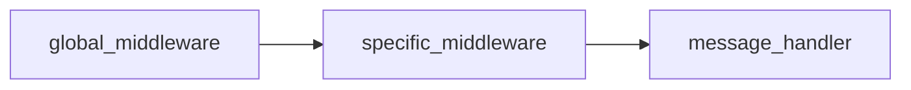
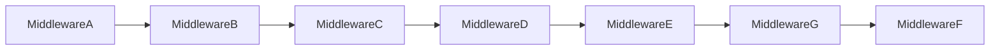

# Middleware

In the framework context, any handler is like a **link of chain**, so you can easily link together multiple handlers (
middlewares). It applies the same concept that frameworks like Laravel have, allowing you to leverage them to separate
repeated logic, or perform checks before executing a message handler.

The best explanation comes from the Laravel documentation:

> It's best to envision middleware as a series of "layers" HTTP requests must pass through before they hit your application. Each layer can examine the request and even reject it entirely.

Where you can replace the HTTP requests with an incoming update from Telegram.

Let's see an example:

```php
use SergiX44\Nutgram\Nutgram;

$bot = new Nutgram($_ENV['TOKEN']);

// global middleware
$bot->middleware(function (Nutgram $bot, $next) {
    $bot->sendMessage('I\'m the global middleware!!');
    $next($bot);
});

$bot->onMessage(function (Nutgram $bot) {
    $bot->sendMessage('I\'m the message handler!!');
})->middleware(function (Nutgram $bot, $next) {

    $bot->sendMessage('I\'m the specific middleware!!');
    $next($bot);
});

$bot->run();
```

In the example above, the sequence of the calls is



As the name says, the `global middleware` will be called before *every* message middleware of every handler (or before
every handler if no middleware specified). The `specific middleware` will be called only before the `message handler`.

The call to `$next($bot)` is needed to proceed through the chain, where `$next` is the next callable, passing the
current instance of the bot. It is possible at any point to stop the execution of the chain, returning from the
function, or not calling the method `$next($bot)`:

```php
use SergiX44\Nutgram\Nutgram;

$bot = new Nutgram($_ENV['TOKEN']);

$bot->onMessage(function (Nutgram $bot) {
    $bot->sendMessage('I will be never called :(');
})->middleware(function (Nutgram $bot, $next) {

    $bot->sendMessage('Stop!');
    //$next($bot);
});

$bot->run();
```

## Passing data

It's possible to pass data between middlewares, using the method `setData` and `getData` on the bot instance, for
example, to automatically retrieve data from a database, perform checks, and so on:

```php
use SergiX44\Nutgram\Nutgram;

$bot = new Nutgram($_ENV['TOKEN']);

// retrieve the user
$bot->middleware(function (Nutgram $bot, $next) {
    $user = get_current_user_from_db($bot->userId());
    $bot->setData('user', $user);
    $next($bot);
});


$bot->onCommand('admin', function (Nutgram $bot) {

    $user = $bot->getData('user');
    $bot->sendMessage("Hi admin $user->name!");
    
})->middleware(function (Nutgram $bot, $next) {

    $user = $bot->getData('user'); // retrieve the user we have set in the global middleware
    if ($user->isAdmin) { // if the user is an admin, continue the chain
        $next($bot);
    }
    $bot->sendMessage('You are not an admin >:(');
});

$bot->onCommand('user', function (Nutgram $bot) {
    $user = $bot->getData('user');
    $bot->sendMessage("Hi user $user->name!");
});

$bot->run();
```

## Before & After

The model allow you to perform actions before and after the chain executed:

```php
use SergiX44\Nutgram\Nutgram;

$bot = new Nutgram($_ENV['TOKEN']);

// global middleware
$bot->middleware(function (Nutgram $bot, $next) {

    // do something before the handlers
    
    $next($bot); // sends "Hi!"
    
    // do something
});

$bot->onMessage(function (Nutgram $bot) {
    $bot->sendMessage('Hi!');
});

$bot->run();

```

## Skipping global middlewares for a specific handler

If you want to skip the global middlewares for a specific handler, you can use the method `skipGlobalMiddlewares()`:

```php
use SergiX44\Nutgram\Nutgram;

$bot = new Nutgram($_ENV['TOKEN']);

// global middlewares
$bot->middleware(GlobalMiddlewareA::class);
$bot->middleware(GlobalMiddlewareB::class);

// handler that skips global middlewares
$bot
    ->onMessage(SendHelloHandler::class)
    ->skipGlobalMiddlewares();

// handler that skips some global middlewares
$bot
    ->onCommand('secret'::class)
    ->skipGlobalMiddlewares([
        GlobalMiddlewareB::class
    ]);

$bot->run();

```

## OOP

Also in this case, all the `$callable` can be also defined as class-method or invokable class:

```php
use SergiX44\Nutgram\Nutgram;

class MyMiddleware {

    public function __invoke(Nutgram $bot, $next) 
    {
      //do stuff
      $next($bot);
    }
}
```

```php
use SergiX44\Nutgram\Nutgram;

class MyCommand {

    public function __invoke(Nutgram $bot, $param) 
    {
      //do stuff
    }
}
```

```php
use SergiX44\Nutgram\Nutgram;

$bot = new Nutgram($_ENV['TOKEN']);

$bot->onCommand('start {param}', MyCommand::class)
    ->middleware(MyMiddleware::class);

$bot->run();
```

### Parameters

You can pass parameters to the middlewares, just using the class constructor:

```php

use SergiX44\Nutgram\Nutgram;
use App\Telegram\Commands\AddChannelCommand;
use App\Telegram\Commands\AddImageCommand;
use App\Telegram\Middleware\CheckUserPermission;

class CheckUserPermission 
{
    protected string $permission;
    
    public function __construct(string $permission)
    {
        $this->permission = $permission;
    }
    
    public function __invoke(Nutgram $bot, $next): void
    {
        //check if user has permssion using $this->permission

        $next($bot);
    }
}

$bot = new Nutgram($_ENV['TOKEN']);

$bot->onCommand('add_channel', AddChannelCommand::class)
    ->middleware(new CheckUserPermission('can_add_channel'));

$bot->onCommand('add_image', AddImageCommand::class)
    ->middleware(new CheckUserPermission('can_add_image'));

$bot->run();
```

## Get current handlers parameters
Nutgram provides the `currentParameters` method allowing you to obtain the parameters of the target handlers. 
You can use this method in any context of the code, not just within middleware.

The `currentParameters` method returns an `array` containing the parameters of the target handlers.
In the bot's code, you can use the array returned by the method to access the handler's parameters and use them in your own code.

### Example usage

Use case:
```php
$bot = new Nutgram($_ENV['TOKEN']);

$bot->group(CheckUserMiddleware::class, function(Nutgram $bot){
    $bot->onCallbackQueryData('user/([0-9]+)/show', [UserController::class, 'show']);
    $bot->onCallbackQueryData('user/([0-9]+)/edit', [UserController::class, 'edit']);
    $bot->onCallbackQueryData('user/([0-9]+)/delete', [UserController::class, 'delete']);
});

$bot->run();
```

Without the `currentParameters` method, you would have to write the following code:
```php
class CheckUserMiddleware
{
    public function __invoke(Nutgram $bot, $next)
    {
        preg_match('/user\/([0-9]+)\/.*/', $bot->callbackQuery()->data, $matches);
        $id = $matches[1];
        //TODO: check user by $id
        $next($bot);
    }
}
```

With the `currentParameters` method, you can write the following code:
```php
class CheckUserMiddleware
{
    public function __invoke(Nutgram $bot, $next)
    {
        [$id] = $bot->currentParameters();
        //TODO: check user by $id
        $next($bot);
    }
}
```

### Warning
The `currentParameters` method returns an array containing **all parameters of all resolved 
handlers** in the current update context.
This behavior can lead to unexpected results in some cases, so be sure to use the method carefully 
and be aware of the parameters of your handlers.

Example:
```php
// CheckUserMiddleware.php
class CheckUserMiddleware
{
    public function __invoke(Nutgram $bot, $next)
    {
        $parameters = $bot->currentParameters();
        //$parameters[0] = 'your-value'; <= for onCallbackQueryData('user/([0-9]+)/show')
        //$parameters[1] = 'your-value'; <= for onCallbackQueryData('user/([0-9]+)/.*')
        $next($bot);
    }
}

// bot.php
$bot = new Nutgram('TOKEN');

$bot->group(CheckUserMiddleware::class, function(Nutgram $bot){
    $bot->onCallbackQueryData('user/([0-9]+)/show', [UserController::class, 'show']);
    $bot->onCallbackQueryData('user/([0-9]+)/.*', [UserController::class, 'edit']);
});

$bot->run();
```

## Grouping

You can group middlewares, using the `group` method:

```php
// before:
$bot->onCommand('start', StartCommand::class);
$bot->onCommand('help', HelpCommand::class);

$bot->onCommand('mute', MuteCommand::class)->middleware(IsAdmin::class);
$bot->onCommand('kick', KickCommand::class)->middleware(IsAdmin::class);
$bot->onCommand('ban', BanCommand::class)->middleware(IsAdmin::class);
$bot->onCommand('unban', UnbanCommand::class)->middleware(IsAdmin::class);

// after:
$bot->onCommand('start', StartCommand::class);
$bot->onCommand('help', HelpCommand::class);

$bot->group(IsAdmin::class, function (Nutgram $bot){
    $bot->onCommand('mute', MuteCommand::class);
    $bot->onCommand('kick', KickCommand::class);
    $bot->onCommand('ban', BanCommand::class);
    $bot->onCommand('unban', UnbanCommand::class);
});
```

### How to use the group method

```php
// single middleware
$bot->group(Middleware::class, function (Nutgram $bot){
    // Your handlers here
});

// multiple middlewares
$bot->group([Middleware1::class, Middleware2::class], function (Nutgram $bot){
    // Your handlers here
});

// nested middlewares
$bot->group(Middleware1::class, function (Nutgram $bot){
    // Your handlers here

    $bot->group(Middleware2::class, function (Nutgram $bot){
        // Your handlers here
    });
});
```

## Flow
The global middlewares are executed in descending order.
The handlers middlewares are executed in **ascending** order. 

```php
use SergiX44\Nutgram\Nutgram;

$bot = new Nutgram($_ENV['TOKEN']);

$bot->middleware(MiddlewareA::class);    // 1°
$bot->middleware(MiddlewareB::class);    // 2°

$bot->group([MiddlewareC::class, MiddlewareD::class], function (Nutgram $bot){    // 3°, 4°
    $bot->group(MiddlewareE::class, function (Nutgram $bot){    // 5°
        $bot->onCommand('start', StartCommand::class)   // 8°
             ->middleware(MiddlewareF::class)     // 7°
             ->middleware(MiddlewareG::class);    // 6°
    });
});

$bot->run();
```

In the example above, the sequence of the calls is


