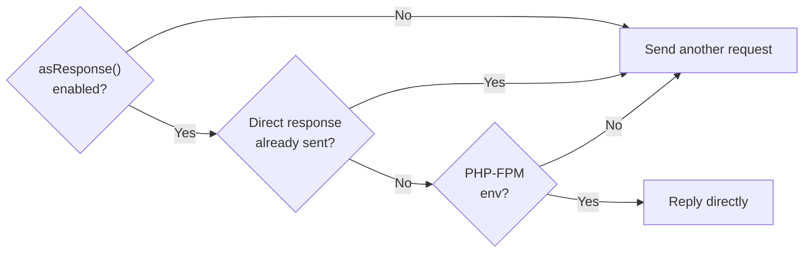

# Sending Requests

The framework creates a 1:1 mapping of the methods Telegram provides that are directly accessible from the main
instance. The parameters of these methods are organized to prioritize mandatory parameters, followed by optional ones.
If the `$clientOpt` parameter is included, it will consistently be positioned at the end.
We recommend the use of named parameters, which allow the developer to explicitly specify the values for each parameter, 
making the code easier to read and maintain.

For example:

```php

use SergiX44\Nutgram\Nutgram;
use SergiX44\Nutgram\Telegram\Types\Message\Message;

$bot = new Nutgram($_ENV['TOKEN']);

// Send a message to a specific user
$message = $bot->sendMessage(
    text: 'Hi!',
    chat_id: 123456789
);

// Send a message to a channel
$message = $bot->sendMessage(
    text: 'Hi channel!',
    chat_id: '@mychannel'
);
```

## Uploading media

For any method that require an [`InputFile`](https://core.telegram.org/bots/api#inputfile), you can pass a resource file
descriptor to the right method, and the framework will take care of how uploading it, like in the following example.

### Via URL

```php
use SergiX44\Nutgram\Nutgram;
use SergiX44\Nutgram\Telegram\Types\Internal\InputFile;
use SergiX44\Nutgram\Telegram\Types\Message\Message;

$bot = new Nutgram($_ENV['TOKEN']);

$message = $bot->sendPhoto(
    photo: 'https://example.com/image.png',
    chat_id: 123456789
);
```

### Via InputFile (file path)

```php
use SergiX44\Nutgram\Nutgram;
use SergiX44\Nutgram\Telegram\Types\Internal\InputFile;
use SergiX44\Nutgram\Telegram\Types\Message\Message;

$bot = new Nutgram($_ENV['TOKEN']);

$message = $bot->sendPhoto(
    photo: InputFile::make('image.png'),
    chat_id: 123456789
);
```

### Via InputFile (file resource)

```php
use SergiX44\Nutgram\Nutgram;
use SergiX44\Nutgram\Telegram\Types\Internal\InputFile;
use SergiX44\Nutgram\Telegram\Types\Message\Message;

$bot = new Nutgram($_ENV['TOKEN']);

$message = $bot->sendVideo(
    video: InputFile::make(fopen('funnyvideo.mp4', 'r+')),
    chat_id: 123456789
);
```

### Via `file_id`

```php
use SergiX44\Nutgram\Nutgram;
use SergiX44\Nutgram\Telegram\Types\Internal\InputFile;
use SergiX44\Nutgram\Telegram\Types\Message\Message;

$bot = new Nutgram($_ENV['TOKEN']);

$message = $bot->sendSticker(
    sticker: $bot->message()->sticker->file_id,
    chat_id: 123456789
);
```

### Get upload progress

You can get the upload progress of the file by calling the `withProgress` method before your upload method.

:::caution
The callback will be called every time **a byte** is uploaded, so if you are printing the progress via Telegram, 
you should find a way to avoid spamming the user and **hitting the API limits**.
:::

```php
use SergiX44\Nutgram\Nutgram;
use SergiX44\Nutgram\Telegram\Types\Internal\InputFile;
use SergiX44\Nutgram\Telegram\Types\Message\Message;

$bot = new Nutgram($_ENV['TOKEN']);

$message = $bot
    ->withProgress(function (Progress $progress) {
        echo sprintf("Uploading video: %s%% - Uploded: %s bytes of %s bytes\n",
            $progress->uploadPercentage(),
            $progress->uploadedBytes,
            $progress->totalUploadBytes,
        );
    })
    ->sendVideo(
        video: InputFile::make('video.mp4'),
        chat_id: 123456789
    );
```

## Downloading media

As opposed to uploading, there are some additional methods available that allow you to download files:

### Via `downloadFile` method

```php
use SergiX44\Nutgram\Nutgram;
use SergiX44\Nutgram\Telegram\Types\Media\File;

$bot = new Nutgram($_ENV['TOKEN']);

$bot->onSticker(function (Nutgram $bot) {
    // get the file_id
    $fileId = $bot->message()->sticker->file_id;
    
    // get the File
    $file = $bot->getFile($fileId);
    
    // download the file
    $bot->downloadFile($file, 'file.ext');
});
```

### Via `save` method
```php
use SergiX44\Nutgram\Nutgram;
use SergiX44\Nutgram\Telegram\Types\Media\File;

$bot = new Nutgram($_ENV['TOKEN']);

$bot->onSticker(function (Nutgram $bot) {
    // get the file_id
    $fileId = $bot->message()->sticker->file_id;
    
    // get the File and download it
    $bot->getFile($fileId)->save('file.ext');
});
```

### Get download progress

You can get the download progress of the file by calling the `withProgress` method before your download method.

:::caution
The callback will be called every time **a byte** is downloaded, so if you are printing the progress via Telegram,
you should find a way to avoid spamming the user and **hitting the API limits**.
:::

```php
use SergiX44\Nutgram\Nutgram;
use SergiX44\Nutgram\Telegram\Types\Media\File;

$bot = new Nutgram($_ENV['TOKEN']);

$bot->onSticker(function (Nutgram $bot) {
    // get the file_id
    $fileId = $bot->message()->sticker->file_id;
    
    // get the File
    $file = $bot->getFile($fileId);
    
    // download the file
    $bot
      ->withProgress(function (Progress $progress) {
          echo sprintf("Downloading file: %s%% - Downloaded: %s bytes of %s bytes\n",
              $progress->downloadPercentage(),
              $progress->downloadedBytes,
              $progress->totalDownloadBytes,
          );
      })
      ->downloadFile($file, 'file.ext');
});
```

## Formatting options

To format your text messages, you can use the `parse_mode` parameter.
Just pass the valid string provided by the Telegram API to the method.

Nutgram provides the ParseMode enum to help you with this:

```php
use SergiX44\Nutgram\Nutgram;
use SergiX44\Nutgram\Telegram\Properties\ParseMode;
use SergiX44\Nutgram\Telegram\Types\Message\Message;

$bot = new Nutgram($_ENV['TOKEN']);

// Send a message formatting in markdown
$message = $bot->sendMessage(
    text: '*Hi!*',
    chat_id: 123456789,
    parse_mode: ParseMode::MARKDOWN,
);

// Send a message formatting in html
$message = $bot->sendMessage(
    text: '<i>Hi!</i>',
    chat_id: 123456789,
    parse_mode: ParseMode::HTML,
);
```

## Available methods
See the [Telegram Bot API](https://core.telegram.org/bots/api#available-methods) for the available native methods.

## Chunked methods
Nutgram helps manage character limits by splitting messages into smaller ones,
making it easier to stay within the limits set by platforms or media.
Chunking methods allow users to transmit longer messages without exceeding the maximum character limits.

Available chunked methods:
- sendChunkedMessage
- sendChunkedPhoto
- sendChunkedAudio
- sendChunkedDocument
- sendChunkedVideo
- sendChunkedAnimation
- sendChunkedVoice

## Reply directly to incoming updates
Nutgram allows you to reply directly to incoming updates, without sending a new request to the Telegram API.
This feature will use the second method of 
[replying to a request](https://core.telegram.org/bots/faq#how-can-i-make-requests-in-response-to-updates), 
which is to reply directly and give the method as JSON payload in the reply.

### Warnings
- You'll need **PHP-FPM** to use this feature.
- This feature, if enabled, will be automatically used only **once per update**. 
- You'll get `null` if you try to use the return type on a method that has been used with this feature. 
- You'll **not get an exception** if you try to enable this feature on a method that has already been used with this feature
  because the method may be called multiple times in the same update depending on the events that are triggered. 
- This feature will be **not used** in multipart requests.

### Flow


### Usage
```php
$bot = new Nutgram('token');

$bot->onCommand('start', function(Nutgram $bot){
    $bot->asResponse()->sendMessage('hello'); // This will reply directly and give the method as JSON payload in the reply
    
    $bot->sendMessage('world'); // This will reply sending a request to the Telegram API
});

$bot->run();
```
